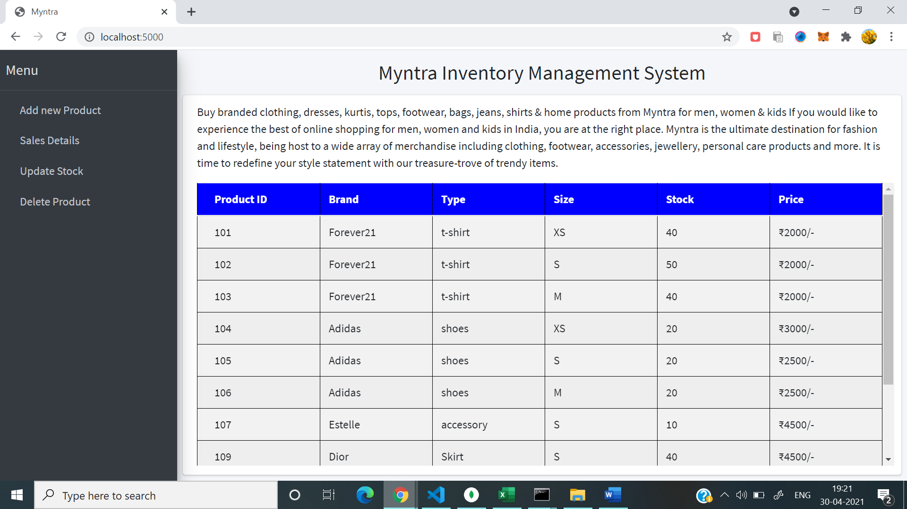
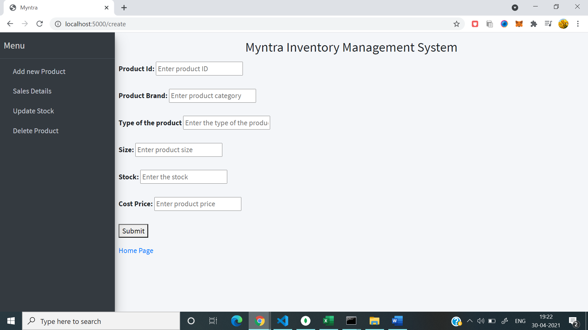
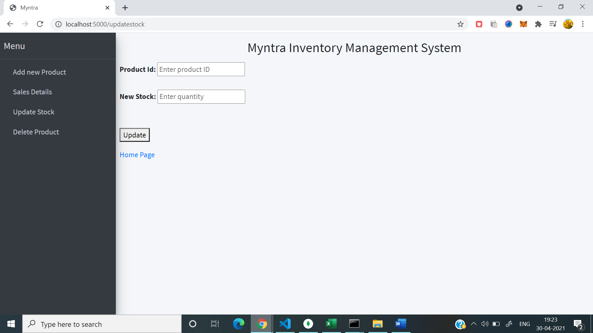
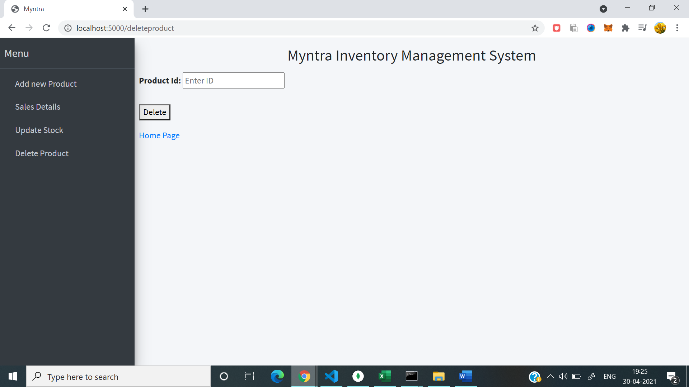

# Myntra-Inventory-Management-System
   An Inventory Management System using CRUD operations with ExpressJS, database as MongoDB and front-end using EJS,AdminLTEBootstrap.

# Home page

# Add stock

# Update stock

# Delete stock

